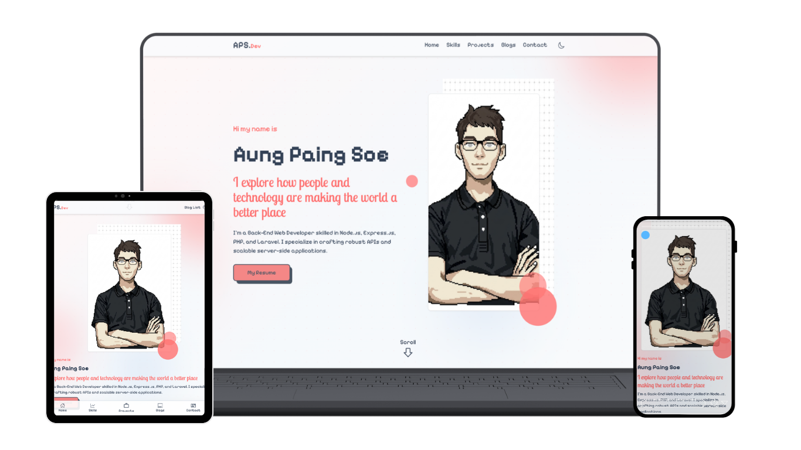

# 🚀 Aung Paing Soe — Portfolio

Personal **portfolio website** for **Aung Paing Soe**, Back-End Web Developer. Built with **React**, **Vite**, and **TailwindCSS**. Features a pixel-style hero, responsive layout across desktop, tablet, and mobile, and sections for Skills, Projects, Blogs, and Contact.

---

## 🖼 Preview



*Responsive design: Laptop • Tablet • Mobile*

---

## ✨ Features

- 🏠 **Home** — Hero with intro, pixel-art style portrait, and “My Resume” CTA
- 🛠 **Skills** — Tech stack and abilities
- 📁 **Projects** — Portfolio grid with links and tech pills
- 📝 **Blogs** — Blog list with search, tag filter, and detail pages (HTML content)
- 📬 **Contact** — Contact section
- 🌙 **Dark / Light theme** — Toggle with persistence
- 📱 **Fully responsive** — Desktop, tablet, and mobile
- ✨ **Animations** — Framer Motion and smooth transitions

---

## 🛠 Tech Stack

| Category      | Tech |
|---------------|------|
| Framework     | React 18 |
| Build         | Vite 5 |
| Styling       | TailwindCSS |
| Animation     | Framer Motion |
| Routing       | React Router v6 |
| Carousel      | Swiper |
| Icons         | React Icons |
| State         | Redux Toolkit (modals) |

---

## 📦 Installation

Clone the repository:

```bash
git clone https://github.com/aungpaingsoedev/portfolio.git
cd portfolio
```

Install dependencies:

```bash
npm install
```

---

## ▶️ Run Development Server

```bash
npm run dev
```

Open in browser:

```
http://localhost:5173
```

---

## 🏗 Build for Production

```bash
npm run build
```

Preview production build:

```bash
npm run preview
```

---

## 📂 Project Structure

```
portfolio/
├── public/
│   ├── images/          # Blog, project, and hero images
│   └── pdf/             # Resume PDF
├── src/
│   ├── components/
│   │   ├── Common/      # Header, Footer, MobileFooter
│   │   ├── Home/        # Hero, Skills, Portfolio, Blog, Contact
│   │   ├── Blog/        # ListSection, DetailSection
│   │   └── Shared/      # Cards, Modals, Utils
│   ├── context/         # ThemeContext (dark/light)
│   ├── features/        # Redux store, modal slice
│   ├── pages/           # home, blog, blog detail
│   ├── server/          # blogs.json, portfolio.json, contact.json
│   ├── assets/          # CSS, fonts
│   ├── App.jsx
│   └── main.jsx
├── index.html
├── package.json
├── tailwind.config.js
└── vite.config.js
```

---

## 📄 Sections

| Section   | Description |
|----------|-------------|
| **Home** | Hero, Skills, Projects, Blog preview, Contact |
| **Skills** | Skills list (from home or nav) |
| **Projects** | Portfolio grid with GitHub/live links and tech stack |
| **Blogs** | List with search, tag filter, featured posts; detail page with HTML content |
| **Contact** | Contact form / info |

---

## 📜 License

This project is licensed under the **MIT License**.

---

## 👨‍💻 Author

**Aung Paing Soe**

- GitHub: [aungpaingsoedev](https://github.com/aungpaingsoedev)
- Portfolio: [aungpaingsoedev.com](https://aungpaingsoe.dev)

---

⭐ If you find this project useful, consider giving it a **star** on GitHub.
